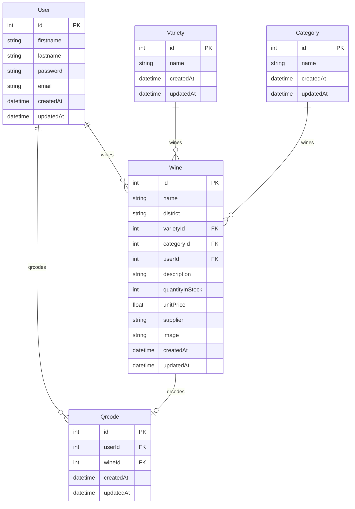

```mermaid
erDiagram
    User ||--o{ Wine : "wines"
    User ||--o{ Qrcode : "qrcodes"
    Variety ||--o{ Wine : "wines"
    Category ||--o{ Wine : "wines"
    Wine ||--o| Qrcode : "qrcodes"
    User {
        int id PK
        string firstname
        string lastname
        string password
        string email
        datetime createdAt
        datetime updatedAt
    }
    Variety {
        int id PK
        string name
        datetime createdAt
        datetime updatedAt
    }
    Category {
        int id PK
        string name
        datetime createdAt
        datetime updatedAt
    }
    Wine {
        int id PK
        string name
        string district
        int varietyId FK
        int categoryId FK
        int userId FK
        string description
        int quantityInStock
        float unitPrice
        string supplier
        string image
        datetime createdAt
        datetime updatedAt
    }
    Qrcode {
        int id PK
        int userId FK
        int wineId FK
        datetime createdAt
        datetime updatedAt
    }
```